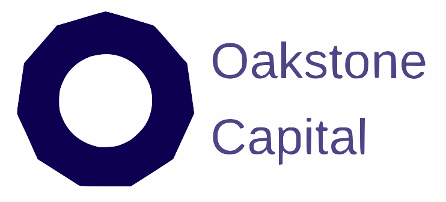

<div align="center">
  
  <br/><br/>
  <h1>Oakstone AI OS</h1>
  <p><strong>Intelligence Service Layer As a Service — powered by Islas</strong></p>
  <p>The internal operating system of Oakstone Capital: a coherent intelligence layer connecting data, tools, and workflows to augment institutional decision-making.</p>
</div>

---

## What This Is

Oakstone AI OS is a customized deployment of [Islas](https://github.com/yourusername/islas) — a generative UI agent hub — configured specifically as the **Intelligence Service Layer** for Oakstone Capital's multi-asset investment and advisory operations.

It implements the 5-layer AI OS architecture described at `oakstone.capital/technology/ai-os`:

| Layer | What it maps to |
|-------|----------------|
| **Experience** | Generative UI chat with domain-specific tool components |
| **Workflow** | Agent job queue with approval workflows and interactive jobs |
| **Intelligence** | LLM orchestration via OpenRouter (100+ models, configurable) |
| **Data** | KnowledgeHub: RAG over financial documents via vector search |
| **Integration** | MCP server, HTTP API, API key management, audit logging |

---

## Mini-App Suite (POC)

| App | What it does |
|-----|-------------|
| **KnowledgeHub** | Upload IMs, pitch decks, reports → semantic search via `openai/text-embedding-3-small` over OpenRouter |
| **DealRoom AI** | Paste a deal summary → structured analysis: exec summary, key terms, risk/mitigant matrix |
| **Deal Pipeline** | Kanban view of all deals by stage (screening → IC review → closed), filterable by vertical |
| **Portfolio View** | Live portfolio grid grouped by the 6 investment verticals |
| **MacroLens** | Market brief generator combining Brave Search + stored market notes |
| **ReportBot** | Automated portfolio summary, market update, and pipeline status reports |

---

## Architecture

Islas is a Bun monorepo. Oakstone-specific configuration lives in `config/oakstone.ts` and is activated via the `TENANT_CONFIG=oakstone` environment variable.

```
.
├── config/
│   ├── oakstone.ts            # Brand, persona, features, glossary
│   └── index.ts               # Config loader (reads TENANT_CONFIG)
├── apps/
│   ├── web/                   # Next.js 16 PWA — Oakstone-themed UI
│   └── agent/                 # Local Pi SDK worker
├── packages/
│   └── convex/convex/
│       ├── agents/orchestrator.ts   # Oakstone AI OS agent persona
│       ├── tools/oakstonTools.ts    # 8 financial intelligence tools
│       ├── functions/documents.ts   # Document ingestion pipeline
│       ├── functions/oakstoneDeals.ts  # Deal CRUD
│       └── chat/searchDocuments.ts  # Vector search over KnowledgeHub
├── docker-compose.yml         # Production VPS stack
├── docker/
│   ├── Caddyfile              # Reverse proxy + auto-HTTPS
│   ├── .env.example           # Config template
│   └── setup.sh               # VPS first-run script
└── scripts/
    └── seed-oakstone.ts       # Seed portfolio, notebooks, context
```

### Deployment topology

```
Internet (HTTPS 443)
    │
    ▼
Caddy (Let's Encrypt)
    ├── ai.oakstonecapital.com        → web:3000      (Oakstone AI OS)
    ├── api.ai.oakstonecapital.com    → convex:3210   (Convex WebSocket + HTTP)
    ├── actions.ai.oakstonecapital.com → convex:3211  (HTTP actions / MCP)
    └── dash.ai.oakstonecapital.com   → dashboard     (Admin, basic auth)
```

### Services

| Service | Image | Purpose |
|---------|-------|---------|
| `convex` | `ghcr.io/get-convex/convex-backend` | Self-hosted Convex (DB + subscriptions) |
| `dashboard` | `ghcr.io/get-convex/convex-dashboard` | Convex admin UI |
| `convex-deploy` | `node:20-slim` (one-shot) | Schema deployment |
| `web` | `apps/web/Dockerfile` | Oakstone AI OS web app |
| `agent` | `apps/agent/Dockerfile` | Local Pi SDK worker |
| `caddy` | `caddy:2-alpine` | Reverse proxy + auto-HTTPS |

---

## VPS Deployment

### Prerequisites

- VPS with Docker + Docker Compose v2 (recommended: Hetzner CPX31 — 4 vCPU, 8GB RAM)
- Domain with DNS A records pointing to your VPS IP:
  - `ai.oakstonecapital.com`
  - `api.ai.oakstonecapital.com`
  - `actions.ai.oakstonecapital.com`
  - `dash.ai.oakstonecapital.com`

### Server setup

```bash
apt update && apt upgrade -y
apt install -y docker.io docker-compose-v2 git ufw
ufw allow 22 && ufw allow 80 && ufw allow 443 && ufw enable
```

### Deploy

```bash
# 1. Clone and configure
git clone https://github.com/yourusername/islas.git /opt/islas
cd /opt/islas
cp docker/.env.example .env
nano .env   # Fill in DOMAIN, ACCESS_PASSPHRASE, OPENROUTER_API_KEY, etc.

# 2. First-time setup (starts Convex, generates admin key, deploys schema, starts all services)
./docker/setup.sh

# 3. Set Convex runtime env vars in the dashboard
# Navigate to https://dash.ai.oakstonecapital.com
# Set: OPENROUTER_API_KEY, DEFAULT_MODEL, ISLAS_API_KEY, BRAVE_SEARCH_API_KEY

# 4. Seed initial data
bun scripts/seed-oakstone.ts
```

### Environment variables

Copy `docker/.env.example` to `.env` and fill in:

```bash
DOMAIN=ai.oakstonecapital.com
TENANT_CONFIG=oakstone

# Generated by setup.sh
CONVEX_ADMIN_KEY=

# Single-user auth (32+ chars)
ACCESS_PASSPHRASE=your-strong-passphrase-32-chars-minimum

# Web Push (npx web-push generate-vapid-keys)
VAPID_PUBLIC_KEY=
VAPID_PRIVATE_KEY=

# Single API key covers ALL AI: LLM calls + embeddings (openai/text-embedding-3-small)
# No separate OPENAI_API_KEY required — OpenRouter handles both.
OPENROUTER_API_KEY=
ISLAS_API_KEY=local-master-key
WORKER_SECRET=              # openssl rand -hex 32
DEFAULT_MODEL=anthropic/claude-sonnet-4-5
MCP_GATEWAY_TOKEN=

# Caddy dashboard auth
DASHBOARD_USER=admin
DASHBOARD_PASSWORD_HASH=    # docker run --rm caddy:2-alpine caddy hash-password --plaintext yourpassword
```

### Common operations

```bash
# View logs
docker compose logs -f

# Rebuild after code changes
docker compose up -d --build web agent

# Redeploy Convex schema after backend changes
docker compose run --rm convex-deploy

# Restart agent only (picks up new skills)
docker compose restart agent

# Stop everything
docker compose down
```

---

## KnowledgeHub: Document Ingestion

Upload financial documents via the chat UI's paperclip button. Supported types:
- PDF (Investment Memoranda, pitch decks, reports, contracts)
- DOCX, TXT (market commentaries, memos)

**Ingestion pipeline**: File → Convex Storage → text extraction → chunking (2000 chars, 200 overlap) → embedding via `openai/text-embedding-3-small` on OpenRouter → stored in `oakstoneDocs` vector index.

**Search**: Hybrid vector + keyword search — the agent calls `searchDocuments` which generates a query embedding via OpenRouter and runs `ctx.vectorSearch` against the index.

---

## AI Model Configuration

The model is configurable per-conversation. Set the default via `DEFAULT_MODEL` in Convex dashboard. OpenRouter gives access to 100+ models:

```bash
# High quality (recommended)
anthropic/claude-sonnet-4-5
anthropic/claude-opus-4-6

# Fast & cost-effective
anthropic/claude-haiku-4-5
moonshotai/kimi-k2.5

# Alternative
openai/gpt-4o
google/gemini-2.5-pro
```

---

## Local Development

### Prerequisites

- [Bun](https://bun.sh) v1.2+
- A [Convex](https://convex.dev) account (free tier)

### Setup

```bash
bun install
cp apps/web/.env.local.example apps/web/.env.local    # fill in Convex URL + passphrase
cp apps/agent/.env.local.example apps/agent/.env.local
bun run dev    # starts web + agent + convex
```

### Local Docker stack

```bash
# Start full local stack (no domain/Caddy required)
docker compose -f docker-compose.local.yml up -d

# Deploy schema to local Convex
cd packages/convex && bunx convex deploy --yes
```

### Dev commands

```bash
bun run dev      # All services via Turborepo
bun run web      # Web app only (localhost:3000)
bun run agent    # Local worker agent only
bun run build    # Production build
bun run lint     # Lint all packages
```

---

## Tech Stack

| Layer | Technology |
|-------|-----------|
| Frontend | React 19, Next.js 16, Tailwind CSS v4, shadcn/ui |
| Backend | Convex (self-hosted), `@convex-dev/agent`, `@convex-dev/auth` |
| Agent | Pi SDK (`@mariozechner/pi-coding-agent`), Bun |
| AI / LLM | OpenRouter API (LLM + embeddings — single key) |
| Embeddings | `openai/text-embedding-3-small` via OpenRouter (1536-dim) |
| Search | Convex vector index + full-text search |
| Proxy | Caddy (automatic HTTPS via Let's Encrypt) |
| Monorepo | Turborepo + Bun workspaces |

---

## Investment Verticals

Oakstone operates across 6 verticals, all supported in the deal pipeline, portfolio view, and document tagging:

- **Credit** — Private credit & structured finance
- **Venture** — Early & growth-stage tech/infrastructure
- **Absolute Return** — Opportunistic multi-strategy
- **Real Assets** — Energy, industrials, utilities, logistics
- **Digital Assets** — Via Boolean platform
- **Listed Assets** — Equities, fixed income, ETFs

---

## Implementation Roadmap

| Phase | Timeline | Focus |
|-------|----------|-------|
| **Phase 1 (current)** | 0–6 months | KnowledgeHub, Deal Co-Pilot, Portfolio View, MacroLens (basic), ReportBot |
| **Phase 2** | 6–18 months | Impala API integration (MacroLens), CreditBrain ML scoring, automated reporting |
| **Phase 3** | 18–36 months | LP dashboards, ClimateDesk, on-chain data via Boolean |

---

## Security

- **Single-user mode**: Passphrase-based auth (httpOnly cookie, 30-day session)
- **API key management**: SHA-256 hashed keys with rate limiting (120 req/min)
- **Agent security profiles**: `MINIMAL` / `STANDARD` / `GUARDED` / `ADMIN` per-job
- **Agent sandbox**: Isolated `/workspace` volume in Docker deployments
- **Approval workflows**: Human-in-the-loop gates for destructive or high-risk actions
- **MCP audit log**: Full audit trail for all Claude Code / external integrations

---

*Built on [Islas](https://github.com/yourusername/islas) — open-source generative UI agent infrastructure.*
